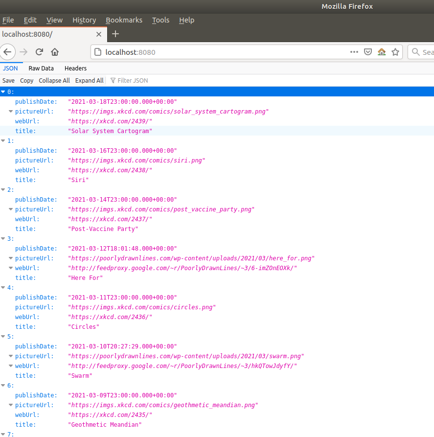

# Toonfeed
<p align="center">   'Toons 'r Fun!</p>

A goofy aggregator of cartoon information that demonstrates some practical concepts from 
Spring's built-in messaging capabilities.

## Why?
This project gave me opportunity to experiment with [Spring Integration](https://spring.io/projects/spring-integration), and its messaging and control bus concepts.

## Overview
Aggregates cartoon data from two sources:

* [PoorlyDrawnLines](http://feeds.feedburner.com/PoorlyDrawnLines) (RSS feed)
* [XKCD](https://xkcd.com/) ([JSON](https://xkcd.com/json.html))

On startup each source is pulled according to [configuration](https://github.com/mrazjava/toonfeed/blob/master/src/main/resources/application.yml), then 
pulled data is converted into internal application model, combined and sorted by publication 
date with most recent records first. Result is exposed over a simple REST endpoint on a default 
path @ localhost:8080.

Once initial fetch is complete, periodic check for latest updates is issued, and the results 
are updated. If this app is ran for a long enough period of time that would allow a remote 
source to publish new data, it will eventually fetch latest data and update its endpoint, 
while removing the oldest publication(s) to remain within the fetch limit.

Sources are pulled using `org.springframework.integration.dsl.IntegrationFlow`.

## Quick Start
Directly with maven:

```
mvn clean spring-boot:run
```

or packaged with docker:

```
mvn clean package
docker-compose up
```

## Screenshot

> *App running in Firefox*
